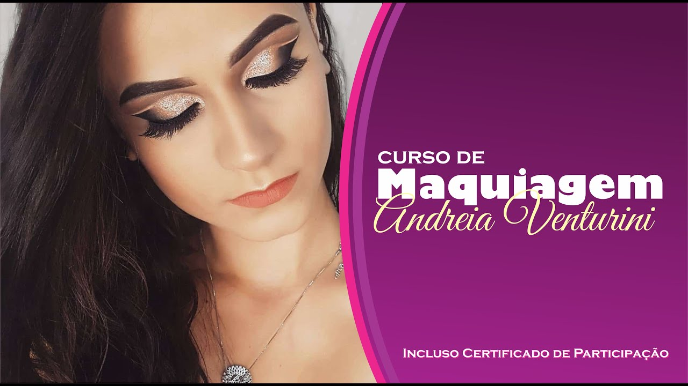
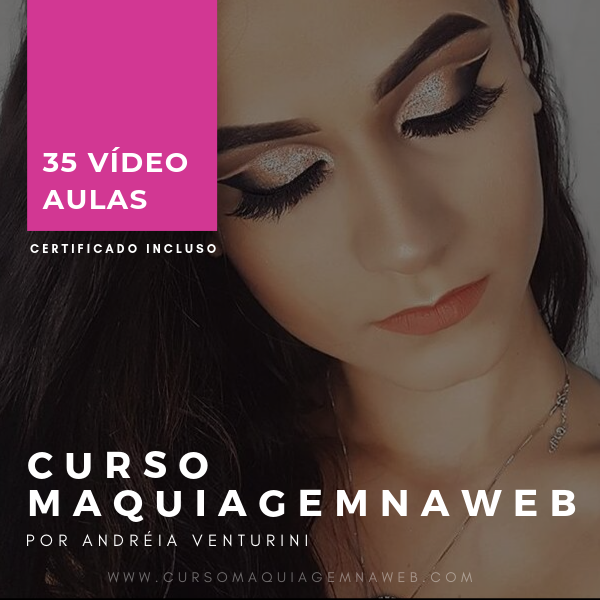

<meta name="viewport" content="width=device-width">
some <em>blue</em> text

**CURSO DE MAQUIAGEM NA WEB**

O Curso Maquiagem na Web é totalmente Online, disponível por 1 ano, 24 horas por dia. São mais de 35 vídeo aulas+ atualizações de novas aulas + certificado Você pode fazer de onde quiser e em qualquer horário, pelo Celular ou Computador Aulas passo a passo, do básico até as técnicas mais avançadas e cheio de dicas e truques para makes incríveis.

[{height=250px}](https://go.hotmart.com/V56123331T?ap=8cc4)

 
## aqui 2

Gabriel Edson SOusa da Silva

[{height=350px}](https://go.hotmart.com/V56123331T?ap=8cc4)

